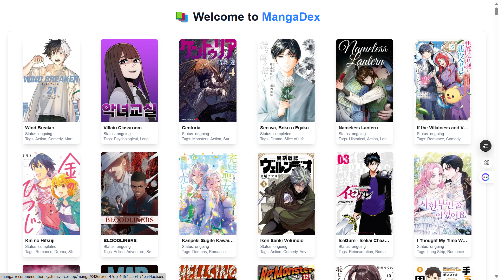
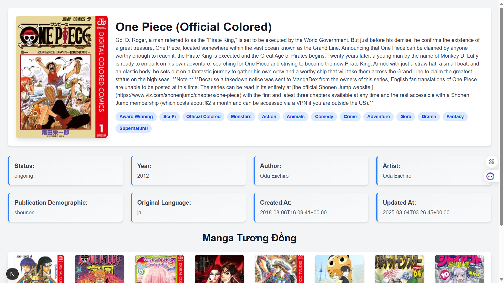
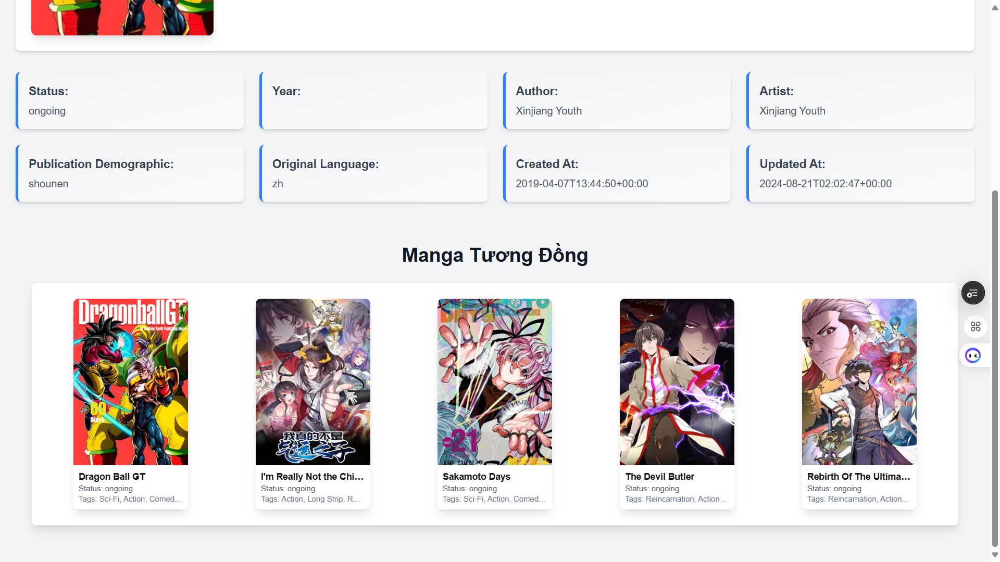

# Manga Recommendation System (Front-End)
<p align="center">
  
  
  
</p>

## Giới Thiệu
Chào mừng bạn đến với **Manga Recommendation System**! Đây là một hệ thống gợi ý manga được xây dựng để giúp người dùng khám phá các manga thú vị từ MangaDex. Dự án này sử dụng thuật toán **Content-Based Filtering** để gợi ý manga dựa trên nội dung manga mà người dùng đang xem.

## Tính Năng Chính
- **Hiển thị danh sách Manga**: Trang chủ sẽ hiển thị một danh sách tất cả các manga, cho phép người dùng duyệt qua các lựa chọn khác nhau.
- **Xem thông tin chi tiết Manga**: Khi người dùng nhấp vào một manga bất kỳ, thông tin chi tiết về manga đó sẽ được hiển thị.
- **Gợi ý truyện Manga**: Dựa trên nội dung của manga người dùng vừa chọn, hệ thống sẽ tự động gợi ý các manga tương tự, giúp người dùng tìm được các manga có chủ đề hoặc thể loại tương đồng.

## Công Nghệ Sử Dụng
- **Next.js**: Một framework mạnh mẽ của React cho việc phát triển ứng dụng web toàn diện.
- **Tailwind CSS**: Một utility-first CSS framework giúp xây dựng giao diện nhanh chóng mà không cần viết CSS thủ công.
- **Vercel**: Nền tảng triển khai và chạy hệ thống của chúng tôi trên môi trường production, mang lại hiệu suất cao và trải nghiệm người dùng mượt mà.

## Yêu Cầu Hệ Thống
Trước khi bắt đầu, bạn cần phải cài đặt phiên bản **Node.js 20.17.0** (hoặc phiên bản tương thích) trên hệ thống của mình.

### Cài đặt Node.js
Để cài đặt Node.js, hãy truy cập vào trang chính của Node.js: [https://nodejs.org](https://nodejs.org) và tải xuống phiên bản **20.17.0** hoặc phiên bản tương thích.

## Hướng Dẫn Cài Đặt & Chạy Dự Án

### 1. Cài Đặt Dependencies
Trước tiên, bạn cần cài đặt tất cả các thư viện phụ thuộc của dự án. Mở terminal và chạy lệnh sau:
```bash
npm install
```

### 2. Khởi động server phát triển
Chạy lệnh sau để khởi động dự án:
```bash
npm run dev
```

Hệ thống sẽ chạy trên **localhost**, bạn có thể truy cập bằng trình duyệt để kiểm tra giao diện và tính năng.

## Liên kết hệ thống
- **Back-End (GitHub)**: https://github.com/LongMyNgoc/Manga-Recommendation-System-BE.git
- **Back-End (Render)**: https://manga-recommendation-system-be.onrender.com/
- **Front-End (GitHub)**: https://github.com/LongMyNgoc/Manga-Recommendation-System.git
- **Front-End (Vercel)**: https://manga-recommendation-system.vercel.app/

## Đóng góp & Phát triển
Chúng tôi luôn chào đón sự đóng góp từ cộng đồng! Nếu bạn có bất kỳ ý tưởng, cải tiến hoặc báo lỗi nào, vui lòng gửi qua hệ thống quản lý mã nguồn của dự án. Bạn cũng có thể liên hệ trực tiếp với nhóm phát triển để thảo luận thêm.

## Thông tin liên hệ
📧 Email: nguyenphilong.dev@gmail.com  